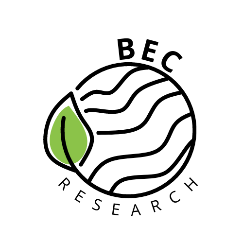

<!-- Welcome to the BEC research group data-sharing template -->
<a name="readme-top"></a>
<!--
*** If you have a question, please email me to amunerab@eafit.edu.co
*** If you have a suggestion, please fork the repository and create a pull request
*** Don't forget to give the project a star!
-->


<!-- PROJECT SHIELDS -->
<!--
*** Here, the "markdown" reference style is used for links
*** First is [brackets] and then (parenthesis)
-->
[![Contributors][contributors-shield]][contributors-url]
[![Forks][forks-shield]][forks-url]
<!-- [![Stargazers][stars-shield]][stars-url] -->
[![Issues][issues-shield]][issues-url]
[![GPL License][license-shield]][license-url]
[![LinkedIn][linkedin-shield]][linkedin-url]


<!-- PROJECT LOGO -->
<br />
<div align="center">
  <a href="https://github.com/amaliamunera/BEC-Template-Repository">
    
  </a>

<h3 align="center">Project-Template-BEC</h3>

  <p align="center">
    A simple and easy-to-use template for all the BEC members!
    <br />
    <a href="https://github.com/amaliamunera/BEC-Template-Repository"><strong>Explore the docs »</strong></a>
    <br />
    <br />
    <a href="https://github.com/amaliamunera/BEC-Template-Repository">View Demo</a>
    ·
    <a href="https://github.com/amaliamunera/BEC-Template-Repository/issues">Report Bug</a>
    ·
    <a href="https://github.com/amaliamunera/BEC-Template-Repository/issues">Request Feature</a>
  </p>
</div>


<!-- TABLE OF CONTENTS -->
<details>
  <summary>Table of Contents</summary>
  <ol>
    <li>
      <a href="#about-the-project">About The Project</a>
      <ul>
        <li><a href="software-hardware--types-of-data">Software, Hardware & Types of Data</a></li>
        <li><a href="#prerequisites">Prerequisites</a></li>
        <li><a href="#installation">Installation</a></li>
      </ul>
    </li>
    <li>
      <a href="#background-information">Background Information</a>
    </li>
    <li><a href="#usage">Usage</a></li>
    <li><a href="#roadmap-and-data-features">Roadmap And Data Features</a></li>
    <li><a href="#contributing">Contributing</a></li>
    <li><a href="#license">License</a></li>
    <li><a href="#contact">Contact</a></li>
    <li><a href="#acknowledgments">Acknowledgments</a></li>
  </ol>
</details>


<!-- ABOUT THE PROJECT -->
## About The Project

[![Product Name Screen Shot][product-screenshot]](https://github.com/amaliamunera/BEC-Template-Repository/blob/main/images/data-network.png)

This is a new space for all members of the research group to have the opportunity to share both research information and research data. 
In this space, you can post images or screenshots if you consider it necessary.  For more information, please contact: `amaliamunera` on GitHub, or `@amalia_munera` on twitter.
<p align="right">(<a href="#readme-top">back to top</a>)</p>


### Software, Hardware & Types of Data

In this space you have the opportunity to mention which software/hardware was used for this project and what is the nature of the data. In [this link](https://dev.to/envoy_/150-badges-for-github-pnk) you will find more badges for you to use in your projects.

* [![Adafruit][Adafruit.com]][Adafruit-url]
* [![ArduinoIDE][ArduinoIDE.com]][ArduinoIDE-url]
* [![Arduino][Arduino.com]][Arduino-url]

<p align="right">(<a href="#readme-top">back to top</a>)</p>

### Prerequisites

Here you can explain, for example, how to list the things you need to use the software, such as libraries, specific programs, etc.

Example: 

* npm
  ```sh
  npm install npm@latest -g
  ```

### Installation

Example of a list of steps on how to install material or download software to use with the data. 

1. Get a free API Key at [https://example.com](https://example.com)
2. Clone the repo
   ```sh
   git clone https://github.com/github_username/repo_name.git
   ```
3. Install NPM packages
   ```sh
   npm install
   ```
4. Enter your API in `config.js`
   ```js
   const API_KEY = 'ENTER YOUR API';
   ```

<!-- GETTING STARTED -->
## Background Information

The aim of this space is to share the information that each researcher considers relevant to their repository and the use of their data. This may be, for example, a theoretical framework to provide context, sources of inspiration for the project, among others.   

<p align="right">(<a href="#readme-top">back to top</a>)</p>


<!-- USAGE EXAMPLES -->
## Usage

Use this space to show useful examples of how a project can be used. Additional screenshots, code examples and demos work well in this space. You may also link to more resources. This space can also be used for links and additional information that you may wish to add. 

<!-- _For more examples, please refer to the [Documentation](https://example.com)_ -->

<p align="right">(<a href="#readme-top">back to top</a>)</p>


<!-- ROADMAP -->
## Roadmap And Data Features

Use this space for specific features or specifications that you want the reader to take into account when reading or using your data. 

- [ ] Feature 1
- [ ] Feature 2
- [ ] Feature 3
    - [ ] Nested Feature

See the [open issues](https://github.com/amaliamunera/BEC-Template-Repository/issues) for a full list of proposed features (and known issues).

<p align="right">(<a href="#readme-top">back to top</a>)</p>


<!-- CONTRIBUTING -->
## Contributing

Contributions are what make the open source community such an amazing place to learn, inspire, and create! Any contributions you make are **greatly appreciated**.

If you have a suggestion that would make this better, please fork the repo and create a pull request. You can also simply open an issue with the tag "enhancement".
Don't forget to give the project a star!

1. Fork the Project
2. Create your Feature Branch (`git checkout -b feature/AmazingFeature`)
3. Commit your Changes (`git commit -m 'Add some AmazingFeature'`)
4. Push to the Branch (`git push origin feature/AmazingFeature`)
5. Open a Pull Request

<p align="right">(<a href="#readme-top">back to top</a>)</p>


<!-- LICENSE -->
## License

Distributed under the GPL-3.0 License. See `LICENSE.txt` for more information.

<p align="right">(<a href="#readme-top">back to top</a>)</p>


<!-- CONTACT -->
## Contact

Amalia Munera - [@amalia_munera](https://twitter.com/amalia_munera) - amunerab@eafit.edu.co

Project Link: [https://github.com/amaliamunera/BEC-Template-Repository](https://github.com/amaliamunera/BEC-Template-Repository)

<p align="right">(<a href="#readme-top">back to top</a>)</p>


<!-- ACKNOWLEDGMENTS -->
## Acknowledgments

* []()
* []()
* []()

<p align="right">(<a href="#readme-top">back to top</a>)</p>


<!-- MARKDOWN LINKS & IMAGES -->
<!-- https://www.markdownguide.org/basic-syntax/#reference-style-links -->
[contributors-shield]: https://img.shields.io/github/contributors/github_username/repo_name.svg?style=for-the-badge
[contributors-url]: https://github.com/amaliamunera/BEC-Template-Repository/graphs/contributors
[forks-shield]: https://img.shields.io/github/forks/github_username/repo_name.svg?style=for-the-badge
[forks-url]: https://github.com/amaliamunera/BEC-Template-Repository/network/members
<!-- [stars-shield]: https://img.shields.io/github/stars/github_username/repo_name.svg?style=for-the-badge
[stars-url]: https://github.com/github_username/repo_name/stargazers -->
[issues-shield]: https://img.shields.io/github/issues/github_username/repo_name.svg?style=for-the-badge
[issues-url]: https://github.com/amaliamunera/BEC-Template-Repository/issues
[license-shield]: https://img.shields.io/github/license/github_username/repo_name.svg?style=for-the-badge
[license-url]: https://github.com/amaliamunera/BEC-Template-Repository/blob/main/LICENSE
[linkedin-shield]: https://img.shields.io/badge/LinkedIn-0077B5?style=for-the-badge&logo=linkedin&logoColor=white
[linkedin-url]: https://linkedin.com/in/amaliamunera
[product-screenshot]: images/data-network.png
[Arduino.com]: https://img.shields.io/badge/Arduino-00979D?style=for-the-badge&logo=Arduino&logoColor=white
[Arduino-url]: https://www.arduino.cc/
[ArduinoIDE.com]: https://img.shields.io/badge/Arduino_IDE-00979D?style=for-the-badge&logo=arduino&logoColor=white
[ArduinoIDE-url]: https://www.arduino.cc/
[Adafruit.com]: https://img.shields.io/badge/adafruit-000000?style=for-the-badge&logo=adafruit&logoColor=white
[Adafruit-url]: https://learn.adafruit.com/


